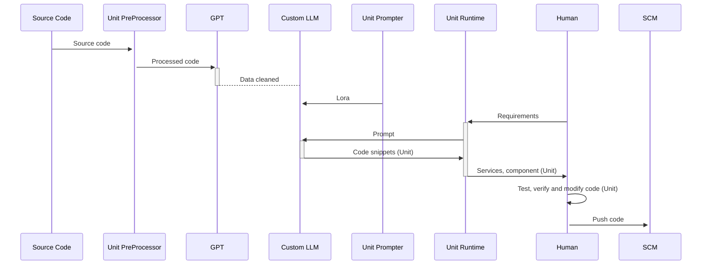

# Unit Runtime

[](https://github.com/prompt-engineering/unit-runtime/actions/workflows/ci.yaml)

> Unit Runtime is an efficient and user-friendly AI code execution environment that allows for one-click startup and real-time interaction, helping you quickly build and test AI code.

Workflow:



For examples:

1. generate a "Hello, world" and send to Kotlin Repl

```kotlin
@RestController
object Pages {
   @GetMapping("/")
   fun main() = "Hello World!"
}
```

2. will start a server like: [http://localhost:10043](http://localhost:10043) , you can test and verify it.

## Websocket API

server: `ws://localhost:8080/repl`

input:

```kotlin
@Serializable
data class InterpreterRequest(
    var id: Int = -1,
    val code: String,
    val language: String = "kotlin",
    val framework: String = "spring",
    val history: Boolean = false
)
```

output:

```kotlin
@Serializable
data class Message(
    var id: Int = -1,
    var resultValue: String,
    var className: String = "",
    var msgType: MessageType = MessageType.NONE,
    var content: MessageContent? = null,
)
```

## Todos

- Backend
    - [x] Kotlin
        - [x] basic REPL
        - [ ] Spring Boot framework based on [https://github.com/JetBrains/kotless](https://github.com/JetBrains/kotless)
        - [x] Ktor framework based on [https://github.com/JetBrains/kotless](https://github.com/JetBrains/kotless)
    - [x] TypeScript
        - [x] basic REPL
        - [x] Deno with Hono
    - [ ] Java
    - [ ] Python
- [x] Frontend
    - [x] React with TypeScript and Babel
    - [ ] Vue
    - [ ]Angular

## Development

1. git clone `https://github.com/prompt-engineering/unit-runtime`
2. `./gradlew bootRun`

API:


## LICENSE

This code is distributed under the MIT license. See [LICENSE](./LICENSE) in this directory.
